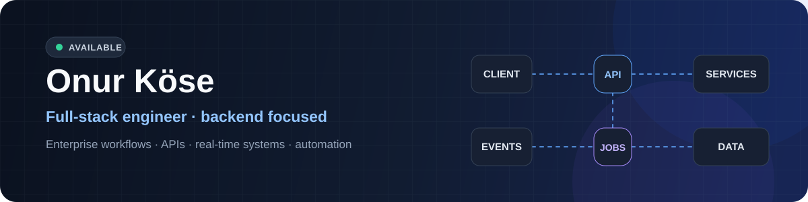

  

   

  
  
  

 

## Building across the stack

My production work is centered on **ASP.NET Core, C#, SQL Server, React, and TypeScript**. I work across the full lifecycle of a feature—from data modelling and API design to the interface, deployment, and production troubleshooting.

<table align="center" width="100%">
<tr>
<td width="50%" align="center" valign="top">

**Backend & architecture**

REST APIs and backend services 
Role-based workflows and authorization 
Background jobs and asynchronous processing 
Database modelling and reporting 
Production troubleshooting

</td>
<td width="50%" align="center" valign="top">

**Product & delivery**

Real-time dashboards with SignalR 
React and Next.js interfaces 
RabbitMQ workflow automation 
IIS and Docker deployments 
Excel/VBA engineering integrations

</td>
</tr>
</table>

 

## Selected work

<table width="100%">
<tr>
<td width="50%" valign="top">

ENTERPRISE PLATFORM

### Design Management System

Used by engineering teams to manage projects from planning through approval and completion.

It connects workload distribution, customer approval cycles, deadlines, reporting, and real-time status updates in one operational workflow.

`ASP.NET Core` `React` `SQL Server`  
`RabbitMQ` `SignalR` `JWT`

</td>
<td width="50%" valign="top">

OPEN-SOURCE .NET LIBRARY

### [FluentTaskScheduler ↗](https://github.com/Onur-Kose/FluentTaskScheduler)

A fluent scheduling API that keeps recurring background-task definitions readable and maintainable.

 

`.NET` `C#` `Background Services`

</td>
</tr>
<tr>
<td width="50%" valign="top">

FULL-STACK COMMERCE

### [Ayçiçek Promosyon ↗](https://aycicekpromosyon.com.tr)

A product platform with an administration panel for managing products, categories, and content.

`Next.js` `TypeScript` `Prisma`  
`PostgreSQL` `Docker`

</td>
<td width="50%" valign="top">

WEB3 PROTOTYPE

### [GymMembershipDApp ↗](https://github.com/Onur-Kose/GymMembershipDApp)

A smart-contract membership prototype exploring Solidity, wallet interaction, and decentralized application workflows.

`Solidity` `Web3` `Smart Contracts`

</td>
</tr>
</table>

 

## Core stack

 

---

**Open to remote international opportunities and technical collaborations.**

Backend engineering · System design · End-to-end product ownership

